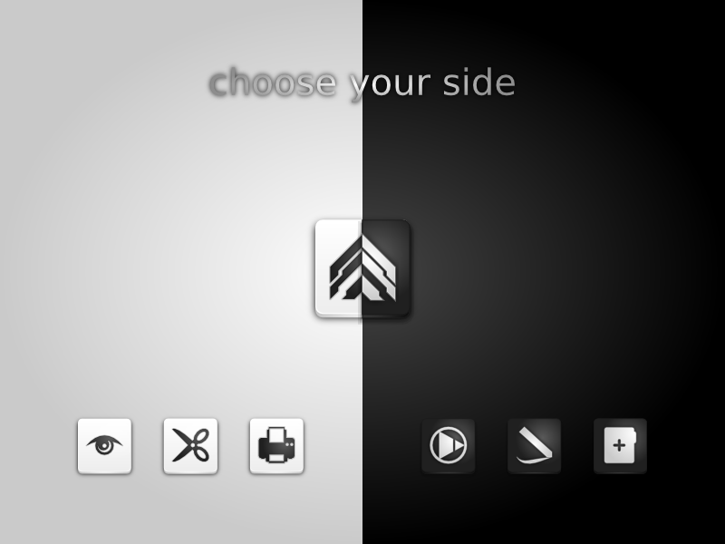
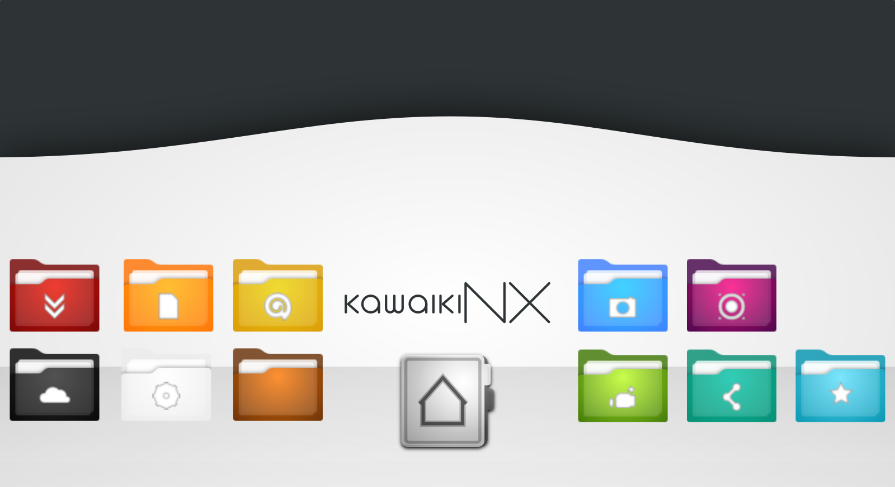

# Kawaiki Icon Theme

## Introduction

Hello, I am happy, that you found my Icon-Theme. I put lots of work into it. It's still far from perfect, but made great progress during the last year. I know, nowadays people like flat, tile-like icons with consistent looks. Consistency really matters, but I just wanted to create a beautiful icon theme which meets the criteria of being consistent, but still giving you unique beauty with great detail for your desktop. I hope you like it, as much as I do and don't hesitate to comment, if you have any problems with it ;)

Please take that one second to vote up, if you like my work :)

## Thanks

Go to all the artists out there, who inspired me with their beautiful works. Especially the creator of the Faenza and Faience Icon Themes, who brought us a new level of beauty on the linux desktop.
I also loved the Human Folder Icons in Ubuntu Jaunty and never understood, why they changed them.

## Installing

Installing Kwaiki Icon Theme ist straight forward. If you want the theme to be available for all users of your PC,
copy all Kawaiki folders to `/usr/share/icons`.
If you want it to be available only for yourself, copy to `~/.icons` (in your `home` directory).

The easiest way of installing is by using the script. It will lead you through the process
and will edit the themes files to go smootheley with your chosen GTK+ theme.

Just run `./INSTALL.sh` from the command line, within the Kawaiki-Icon-Theme folder.
Run as root to install for all users.

# Colors

+ Human Earth `#ff7800` to `#672c00`
+ Happy Frog `#beff20` to `#3b7400`
+ Ice Princess `#5de0ff` to `#0094af`
+ Wild Serengeti `#ffb000` to `#ff7100`
+ Pitch Black `#292929` to `#000000`
+ Snow White `#ffffff` to `#ebebeb`
+ Summer Wine `#ed0f00` to `#740000`
+ Purple Gem `#ff0082` tom `#420046`

## Changelog

|Date           |Version  |Comment                                                              |
|---------------|---------|---------------------------------------------------------------------|
|2014-10-24     |0.9.6    |New Package, new Structure, Links instead of double files, Two new Flavors: PitchBlack and SnowWhite|
|2014-01-28     |0.8 Many |Improvements, many icons now have different appearance in different sizes, all folder-themes are complete, many bugfixes (especially symbolic icons) - nearing final release|
|2014-01-28     |0.7      |Complete Folder-Icons-Sets plus one new flavour: WildSerengeti. Started different icons for different sizes. Places (except for Grey Theme): Complete! Look forward for the final release|
|2014-01-20     |0.6      |Added several Color-Flavors: GoldenSunshine, HumanEarth, SummerWine, HappyFrog, IcePrincess, PurpleGem|
|2013-04-06     |0.5.1    |This is not really an update. I removed all the distribution-icons until I will have figured out alll the legal stuff, permissions and logo guidelines of all the applications and distributors out there.|
|2013-04-06     |0.5      |Complete Places, Complete Devices|
|2013-04-01     |0.4      |Complete Mimetype Set included|
|2013-03-27     |0.3      |New icons and changed structure, added index.theme, it is an installable icon theme now, missing icons should be replaced by those of the gnome, tango and hicolor themes|
|2013-03-26     |0.2      |New device icons|
|2013-03-25     |0.1      |Folder icons and a few devides.|

